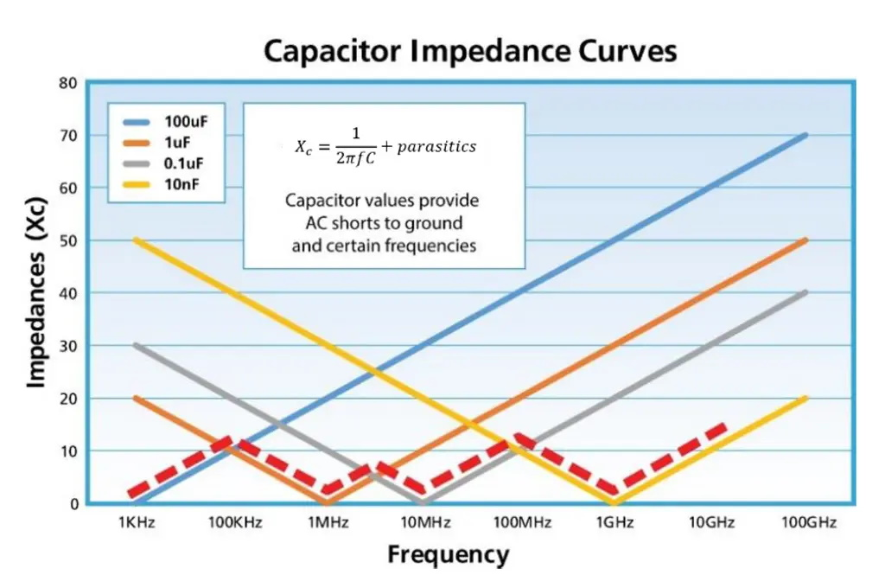

### blocking / bypass / decoupling -capacitors  
increasing the purity of DC by bypassing all unwanted (RF-) AC to ground,   
supporting the DC supply to be able to deliver very fast current peaks.  
#### main requirements:
 - non polarized  
 - lowest possible impedance at the frequency range we want to supress / bypass
 - lowest possible capacitor self-inductance (ESL)
 - t.b.d.
 - t.b.d.

----

  

----
Quote from here <a href="/What is a Capacitor - basic concepts and formulae.pdf">What is a Capacitor - basic concepts and formulae</a>:  
*"Utilise different capacitors (in parallel) for decoupling different frequencies:   A single capacitor is not always able to remove all the frequencies that may be present on a voltage supply line etc. To fully achieve this, it is often the practice to use tow capacitors in parallel: one such as an electrolytic with a larger value to remove the low frequency components (the electrolytic capacitor is not good at passing high frequency signals); and one such as a ceramic capacitor with a smaller value for removing the high frequency components (the smaller ceramic capacitor will not have a low enough reactance to pass the low frequency components).*  

*When using this approach it is necessary to be aware of the effects of spurious series inductance because it is possible for the stray inductance from one capacitor to resonate with the capacitance of the second. These effects do not normally cause a problem, but running two capacitors in parallel can give rise to these combined effects."*  
